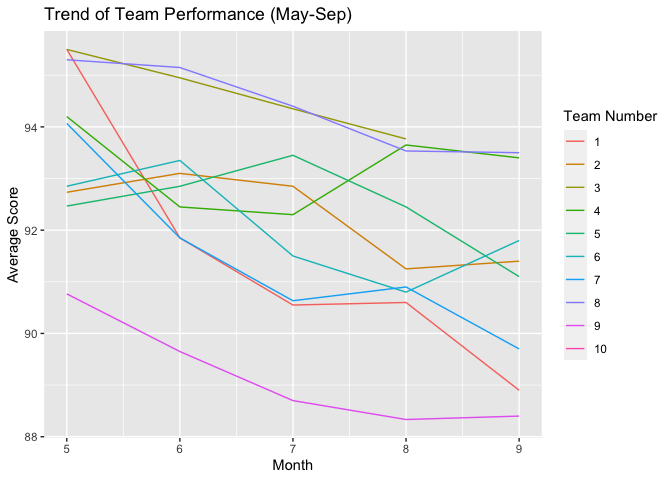

1.  Introduction:

This project analyzes team performance data from a dataset named
“e1\_data.csv”. The dataset contains information about various teams,
their assessment scores, and the locations where the assessments were
conducted. My analysis aims to provide insights into team performance,
score distributions, and geographical patterns.

1.  Dataset Overview:

The “e1\_data” dataset consists of 91 rows and 5 columns:

-   teamno: Team identifier
-   num\_people: Number of people in each team
-   assessment\_date: Date of the assessment
-   score: Performance score
-   location: Place where the assessment was conducted

For example, the first row of data shows: Team 1, with 8 members, scored
96.2 in an assessment conducted on May 15th in Norfork.

1.  Methodology

I use R for my analysis, leveraging packages such as tidyverse for data
manipulation and ggplot2 for visualization. My approach involves data
processing and data visualizations (bar charts, histograms, density
plots, line graphs, geographical mapping of scores).

1.  Expected outcome

This analysis will provide insights into:

-   Top-performing teams as well as low-performing teams
-   Distribution of scores and any patterns or anomalies
-   Geographical variations in scores across Massachusetts counties

## Part 1: Bars and Histograms

For the first part of this project, I am going to focus on team-by-team
performance.

For part 1a., I take the data and create a subsidiary data set which has
one row for each team and then the average (mean), maximum, and minimum
scores that they achieved.

    e1_df <- read_csv("/Users/linh/PROJECTS/R/e1_data.csv") 

    ## Rows: 90 Columns: 5
    ## ── Column specification ────────────────────────────────────────────────────────
    ## Delimiter: ","
    ## chr (2): assessment_date, location
    ## dbl (3): teamno, num_people, score
    ## 
    ## ℹ Use `spec()` to retrieve the full column specification for this data.
    ## ℹ Specify the column types or set `show_col_types = FALSE` to quiet this message.

    e1_stat <- e1_df %>%
      group_by(teamno) %>%
      summarize(mean_score = mean(score),
                max_score = max(score),
                min_score = min(score))
    e1_stat <- e1_stat[order(e1_stat$mean_score, decreasing = TRUE),]
    e1_stat

    ## # A tibble: 10 × 4
    ##    teamno mean_score max_score min_score
    ##     <dbl>      <dbl>     <dbl>     <dbl>
    ##  1      3       94.5      96.2      93.1
    ##  2      8       94.5      95.9      93.2
    ##  3      4       93.2      95.3      90.7
    ##  4      5       92.6      93.9      91.1
    ##  5      2       92.4      94.5      89.9
    ##  6      6       92.1      94.2      90.2
    ##  7     10       91.8      91.8      91.8
    ##  8      1       91.8      96.2      88.9
    ##  9      7       91.8      94.8      89.7
    ## 10      9       89.3      91.3      87.8

Based on the table e1\_stat:

-   Team 3 consistently outperformed others with the highest mean score
    (94.54) and maximum score (96.2).
-   Most teams maintained relatively consistent performance, with mean
    scores ranging from 89.31 to 94.54.
-   Team 1 showed the widest performance range, with scores varying from
    88.9 to 96.2.
-   The lowest minimum score (87.8) belonged to Team 9, indicating
    potential areas for improvement.

For part 1b, I create a bar chart with each team number and the number
of people who are on that team, then color in the fill according to
their average scores.

    summarized <- e1_df %>% group_by(teamno, num_people) %>% summarize(avg_score = mean(score)) 

    ## `summarise()` has grouped output by 'teamno'. You can override using the
    ## `.groups` argument.

    summarized %>% ggplot(aes(x = reorder(factor(teamno), avg_score), y = num_people, fill = avg_score)) + 
      geom_col() +
      geom_text(aes(label = num_people), hjust = -0.2, color = "black", size = 3.0) +
      #scale_fill_gradient(low = 'lightblue', high = 'darkblue')
      scale_fill_distiller(palette = "RdYlBu", direction = 1) + 
      labs(title = 'Relationship Between Team Size and Average Scores', 
           x = 'Team Number',
           y = 'Team Size',
           fill = 'Average Score') +
      theme_minimal() + coord_flip() +
       ylim(0, max(summarized$num_people) * 1.1)

 Based on the
bar chart, we can draw the conclusion that larger team size does not
necessarily correlate with better performance:

-   Top Performers: Teams 3 and 8, both with 10 members, achieved the
    highest average scores (around 94). This suggests that a team size
    of 10 might be optimal for high performance in this context.
-   Lowest Performance: Team 9, with 11 members, shows the lowest
    average score (around 90).
-   The majority of teams fall in the middle range of performance
    (scores between 91-93), regardless of their size.

For part 1c, I create a histogram and a density plot, separately,
showing the distribution of average scores over the time period.

    summarized_date <- e1_df %>% group_by(assessment_date) %>% summarise(avg_score = mean(score))
                          
    summarized_date %>% ggplot(aes(x = avg_score)) +
      geom_histogram(binwidth = 0.5, col = "black", fill = "blue") + 
      labs(title = 'Distribution of Average Scores',
      x = 'Average Score',
      y = 'Frequency')

    summarized_date %>% ggplot(aes(x = avg_score)) +
      geom_density(color = "black", fill = "orange") + 
      labs(title = 'Distribution of Average Scores',
      x = 'Average Score',
      y = 'Density')

For part 1d, I overlay both the histogram and the density plot into the
same chart.

    summarized_date %>% ggplot(mapping = aes(x = avg_score)) +
      geom_histogram(aes(y = after_stat(density), binwidth = 0.5)) +
      geom_density(kernel = "epanechnikov", color = "orange") +
      labs(
        title = "Distribution of Average Scores",
        x = "Average Score",
        y = "Density"
      ) 

    ## Warning in geom_histogram(aes(y = after_stat(density), binwidth = 0.5)):
    ## Ignoring unknown aesthetics: binwidth

    ## `stat_bin()` using `bins = 30`. Pick better value with `binwidth`.

 Based on
the density plot:

-   The distribution appears to be roughly normal, with a slight right
    skew. The peak of the density curve suggests that the most common
    average scores are around 92-93.
-   High Performers: There are a few teams with scores above 94,
    representing the top performers. These teams might have best
    practices that could be valuable to study and potentially implement
    across other teams.
-   Low Performers: The left tail of the distribution shows a few teams
    with scores below 91. These teams may require additional support to
    improve their performance.

## Part 2

For part 2, I am interested in the time and place aspects of the
scoring.

For Part 2a, I create a new (temporary) data frame to support the
visualization which shows the average performance of all teams in
aggregate month-by-month. Then I create a second chart which shows a
separate line for each team; use the “linetype” aes to differentiate.

    temp_df <- e1_df %>%
      mutate(assessment_date = as.Date(assessment_date, format = "%B %d")) %>%
      group_by(teamno, month = month(assessment_date)) %>%
      summarize(avg_score = mean(score))

    ## `summarise()` has grouped output by 'teamno'. You can override using the
    ## `.groups` argument.

    temp_df %>% ggplot(aes(x = month, y = avg_score, group = teamno, color = factor(teamno))) +
      geom_line() +
      labs(title = "Trend of Team Performance (May-Sep)",
           x = "Month",
           y = "Average Score",
           color = "Team Number")

 Based on the
line chart, there is a general downward trend in performance for most
teams over the five-month period, suggesting systemic factors affecting
team productivity or scoring.

Finally, for part 2b, I create a geographical plot of average scores by
county.

    map_score <- e1_df %>% group_by(location) %>% summarize(avg_score = mean(score)) %>% mutate(location = tolower(location))

    state_map <- map_data('county', 'mass') %>% rename(location = subregion) %>% left_join(map_score, by = 'location')

    p <- ggplot(state_map, aes(long, lat, group=group))

    p +  geom_polygon(aes(fill = avg_score), color = 'yellow') +
      coord_map(projection ='albers', lat0 = 39, lat1 = 45) + 
      scale_fill_gradientn(colors = c("#4891FF", "#4183E7", "#3A75CF", "#3367B7", "#2C599F", "#254B87", "#1E3D6F", "#172F57")) +
      labs(title = "Average Scores by County in Massachusetts",
          x = "Longitude",
          y = "Latitude",
          fill = "Average Score"
      )

Based on the map:

-   There is a noticeable east-west divide in performance.Eastern
    counties, particularly those in and around the Greater Boston area,
    show higher average scores (darker blue). Western counties generally
    display lower average scores (lighter blue).

-   The highest-performing counties (darkest blue) are concentrated in
    the eastern part of the state, likely including Suffolk County
    (Boston) and its surrounding areas. This could indicate advantages
    in urban and suburban areas, possibly due to greater access to
    resources, educational institutions, or economic opportunities.

-   Coastal counties show some variation in performance. Cape Cod and
    the islands (likely Nantucket and Martha’s Vineyard) appear to have
    moderately high scores.
